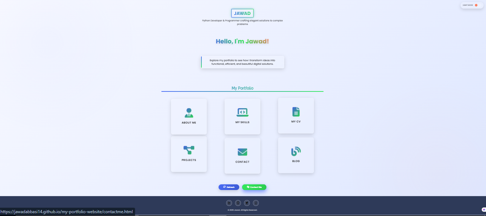
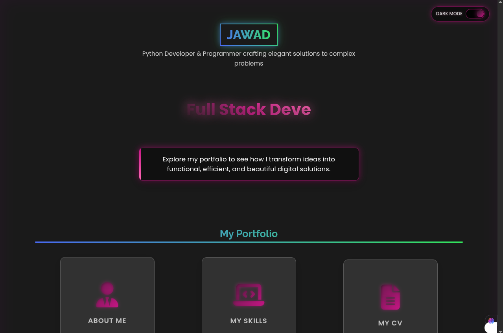

# 🚀 MJ Abbasi – Personal Portfolio Website

Welcome to the official portfolio of **MJ Abbasi**, a passionate full-stack developer, designer, and tech enthusiast.  
This project showcases my work, skills, and personality — all wrapped in a modern, responsive, and elegant web experience.

---

## 🌐 Live Site

📍 **View Online:**  
🔗 [Click here to visit the live portfolio](https://jawadabbasi14.github.io/Mj-Porfolio/)

---

## ✨ Highlights & Features

| Feature                        | Description                                                                 |
|-------------------------------|-----------------------------------------------------------------------------|
| 🌓 Light/Dark Mode            | Toggle between soft-light and sleek-dark themes seamlessly                  |
| 📱 Fully Responsive           | Optimized for all devices — mobile, tablet, desktop                         |
| 💼 Project Showcase           | Visually organized static portfolio layout                                 |
| 🎨 Intro & Services Sections  | Cleanly split pages with modular HTML design                               |
| 📄 CV/Resume Preview          | Embedded downloadable PDF CV                                                |
| 📂 Multi-Page Architecture    | Pages: Intro, Services, Blog, CV, Projects                                  |
| ⚡ Hosted via GitHub Pages    | Fast, free, and stable static hosting                                      |

---

## 🖼️ Screenshots

### 🌞 Light Mode

### 🌙 Dark Mode

---

## 🛠 Tech Stack

| Tech         | Role                                |
|--------------|--------------------------------------|
| `HTML5`      | Page structure                       |
| `CSS3`       | Styling & layout                     |
| `Vanilla JS` | UI interaction and toggles           |
| `GitHub Pages` | Deployment and hosting             |

---

## 📁 Project Structure

